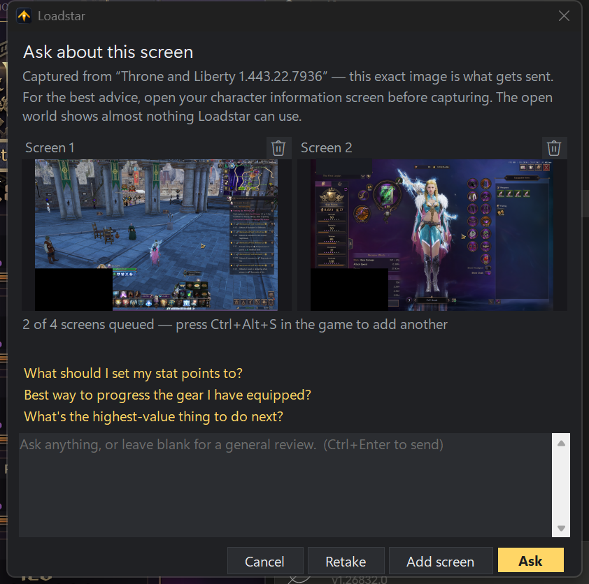
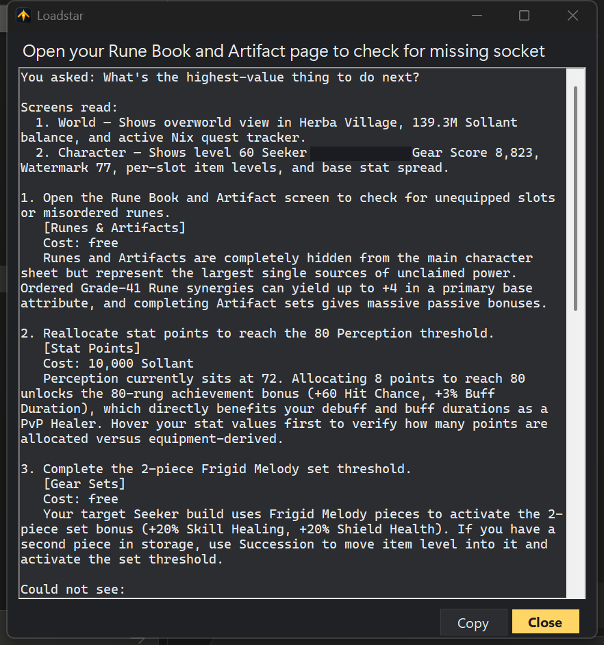
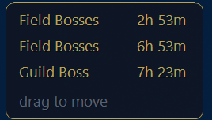

# Loadstar

An AI game companion overlay for Windows. Loadstar watches your screen, compares what it
sees against the build you're aiming for, and tells you the highest-value thing to do next
with the resources you actually have.

First supported game: **Throne and Liberty**.

## What it looks like

Real captures from a live session. The player's character name is blacked out; nothing else is edited.

<table>
<tr>
<td width="50%" valign="top">

**Press the hotkey, ask a question.** Up to four screens travel with one question. Every one is shown
here before anything is sent, each with a delete button — so what leaves your machine is what you saw
and approved. The hotkey queues another screen without closing this window.



</td>
<td width="50%" valign="top">

**Get a ranked, priced answer.** It states which screens it read and what it found on each, then ranks
actions by value for the cost — free moves first — and ends with what it could not see, so you know
what to show it next.



</td>
</tr>
</table>

**Boss countdowns in the corner, without opening anything.** Draggable, and it can alert you a
configurable number of minutes before each spawn.



> [!IMPORTANT]
> Loadstar never touches the game. It does not inject code, hook the renderer, read process
> memory, or send input. It captures the screen the same way OBS does and draws its own
> separate window on top. See [docs/anti-cheat-posture.md](docs/anti-cheat-posture.md) for
> the full design constraints and [DISCLAIMER.md](DISCLAIMER.md) before you use it.

## What it does

- **Reads your state from the screen.** On a cadence you set, and only after you explicitly
  consent, it snapshots the game window and extracts your gear, levels, currencies, tokens,
  and inventory.
- **Knows where you're going.** Paste a [questlog.gg](https://questlog.gg) build URL in
  settings. Loadstar pulls the full target loadout — weapons, gear, runes, traits, skills.
- **Tells you what to do next.** The gap between current and target is handed to Claude or
  GPT, which returns a ranked, resource-aware plan: what to upgrade, what to hold, what not
  to waste your gold and tokens on.
- **Remembers the whole session.** Each play session is one ongoing conversation, not a series
  of unrelated questions. The assistant knows what it already told you, whether you did it, and
  which way your gold has been moving — so it can say "you're 40k short of the upgrade you've
  been saving for" instead of re-deriving your situation from scratch every two minutes. See
  [docs/conversation-model.md](docs/conversation-model.md) for how that stays affordable.
- **Tracks world bosses.** A per-region, per-server-timezone spawn schedule with countdowns
  and configurable pre-spawn alerts.

## Status

Early. See the [project board](../../projects) for what's landed and what's next.

## Requirements

- Windows 10 version 2004 (build 19041) or newer — required for the capture API. Windows
  Graphics Capture itself dates to 1903, but capturing without a UI thread to pump needs
  `Direct3D11CaptureFramePool.CreateFreeThreaded`, which arrived in 2004.
- The game running in **borderless windowed** mode (see [Fullscreen](#fullscreen) below)
- An API key for **Anthropic**, **OpenAI**, or **Google Gemini** — pick the provider in Settings.
  Gemini has a free tier, so it is the one that works without a billing account.

No .NET install needed — the installer ships a self-contained build.

## Install

**[Download the latest release](../../releases/latest/download/Loadstar-x64.msi)** and run it. That
link always resolves to the newest stable version, so it stays correct as new ones ship.

**It keeps itself current.** From 0.24.0 onward Loadstar checks for a newer release when it starts and
offers it — one click, and it installs over the top keeping your settings and API key. It never installs
anything on its own: Windows asks for permission every time, because the installer needs it. Turn the
check off with "Tell me when a new version is out" in Settings, and it stays available from the tray menu.

Installers are published per language — English, Russian, Ukrainian, Spanish, German, French,
Japanese, Korean and Traditional Chinese. Pick `Loadstar-<version>-x64-<lang>.msi` from the
[latest release](../../releases/latest); every version is kept under [Releases](../../releases).

There is also a **[rolling build of `main`](../../releases/download/latest-build/Loadstar-x64.msi)**,
rebuilt on every push and marked as a prerelease. It is useful for trying a fix before it is
released, and it carries a higher version number than the current release by design — so if you
install it and later want to go back to a stable version, uninstall it first, or the installer will
correctly refuse to downgrade.

Everything needed to run is inside the MSI. There is no separate .NET download, and no prerequisite
beyond the Windows version above.

### Windows will warn you, and it should

The installer is **not code-signed**. Windows shows a full-screen SmartScreen dialog —
*"Windows protected your PC"* — with no visible Run button; it's behind **More info → Run anyway**.
Your browser may separately warn that the file isn't commonly downloaded, and the elevation prompt
after that reads **Unknown publisher**.

That is the correct behaviour for an unsigned installer from a small project, and clicking through
it is a real decision rather than a formality. Two things you can actually check:

- **The download URL is on `github.com/eugenebednik/loadstar`.** There is no mirror, no alternate
  channel, and no installer hosted anywhere else. Anything else claiming to be Loadstar isn't.
- **Every installer is built by public CI from public source.** The
  [workflow](.github/workflows/build.yml) builds and publishes a named commit, so what's inside the
  MSI traces back to a diff you can read — which is a stronger guarantee than a signature, not a
  weaker one.

Signing needs a paid certificate renewed annually, and since 2023 the private key has to live on
hardware or in a cloud HSM. So the warning is a funding problem, not a design decision. If that
changes, this section disappears. How releases are produced and who authorizes them is documented in
[docs/code-signing-policy.md](docs/code-signing-policy.md).

To build from source:

```bash
dotnet publish src/Loadstar.App -c Release -r win-x64 --self-contained
```

To build the installer locally, which needs the WiX CLI:

```bash
dotnet tool install --global wix --version 5.0.2
wix extension add --global WixToolset.UI.wixext/5.0.2
wix build installer/Loadstar.wxs -arch x64 -culture en-US -define Version=0.1.0 \
  -bindpath "publish=$PWD/publish" -bindpath "installer=$PWD/installer" \
  -ext WixToolset.UI.wixext -out artifacts/Loadstar-x64.msi
```

## Before it can help you: expand the currency bar

> [!WARNING]
> Throne and Liberty collapses the currency bar by default, showing **only gold**. Click the
> arrow at the top-left ("View all currency") so the full row of tokens is visible along the
> top edge, and leave it expanded while Loadstar runs.

This is not a nicety. The entire point of the tool is telling you how to spend resources — and
with the bar collapsed the assistant can see exactly one of them. It will still produce
confident advice, and that advice will be wrong, because it is reasoning about a wallet it
cannot see.

Loadstar checks for this after every capture, not just at startup, and says so loudly if the
bar gets collapsed mid-session.

There is a second, one-time step worth doing: the bar shows **icons and numbers with no
names**, so open the full currency window once and hit the capture hotkey. Loadstar keeps that
single image as a reference and pairs it with every later reading, which is what lets icons
resolve to the right currency names.

## Configuration

Everything lives in Settings, and everything is editable:

| Setting | Notes |
| --- | --- |
| Game | Currently Throne and Liberty |
| Target build | A questlog.gg build URL, or pasted build JSON |
| AI provider | Anthropic or OpenAI |
| Model | Claude Sonnet/Opus, or GPT 5.5+ |
| API key | Encrypted at rest with Windows DPAPI, scoped to your user account |
| Capture cadence | How often to snapshot, and which regions to look at |
| Region / server | Drives the world boss schedule |
| Overlay | Position, opacity, click-through, hotkeys |

Your API key is never sent anywhere except the provider you chose. Screenshots go to that
provider and nowhere else. Loadstar has no backend.

Full detail — what is captured, what leaves your machine, what is stored and where — is in the
**[privacy policy](https://eugenebednik.github.io/loadstar/privacy)**
([source](docs/privacy.md)).

## Fullscreen

A non-injecting overlay cannot draw over a game in **exclusive fullscreen** — that's a
Windows compositor rule, not a Loadstar limitation, and working around it would mean
hooking the game, which is exactly what this project refuses to do. Run Throne and Liberty
in borderless windowed mode. Capture and suggestions still work in exclusive fullscreen;
only the on-screen overlay is unavailable, so it falls back to a toast in the corner of
your second monitor if you have one.

## Cost

You pay your provider directly, per snapshot analyzed. A snapshot is one image plus a small
text payload. Loadstar shows a running estimate in the status bar and lets you set a hard
monthly ceiling — it stops analyzing when you hit it rather than surprising you.

## License

[MIT](LICENSE). Not affiliated with, endorsed by, or connected to NCSOFT, Amazon Games, or
questlog.gg.
